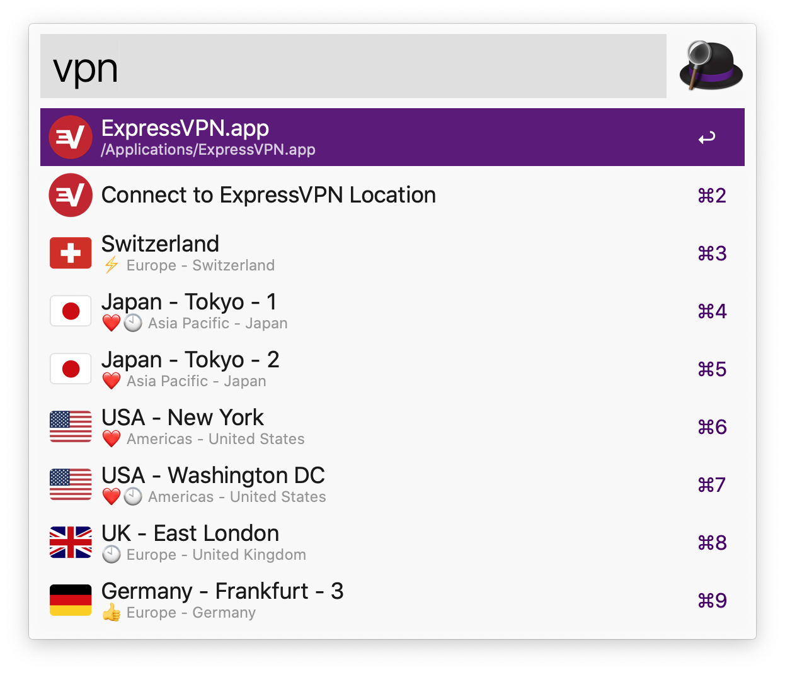
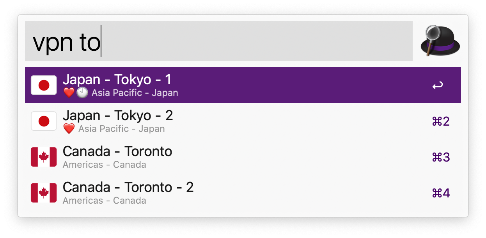

# Expresso CLI for ExpressVPN

expresso is a command line interface to control the ExpressVPN app. It uses the same native messaging interface as the open-source ExpressVPN browser extension.

# Setup

[Download the latest release here](https://github.com/sttz/expresso/releases). expresso is a self-contained executable and has no dependencies.

Or you can install via [Homebrew](https://brew.sh/) using [sttz/homebrew-tap](https://github.com/sttz/homebrew-tap), see the tap readme for instructions.


# Alfred Workflow

expresso also comes with an [Alfred](http://alfredapp.com) workflow, which enables to easily choose locations, connect and disconnect from Alfred.

[Download the workflow here](https://github.com/sttz/expresso/releases). The workflow bundles expresso, so you don't need to install anything else.





**Legend**
* ⚡️Connected location
* ❤️Location favorited in the ExpressVPN app
* 🕙Recent location
* 👍Recommended «Smart Location»

# Usage

```
expresso v1.0.1

USAGE: expresso [--help] [--version] [--verbose...] [--quiet] [--timeout <arg>] 
                <action> 

GLOBAL OPTIONS:
 -h, --help       Show this help 
     --version    Print the version of this program 
 -v, --verbose    Increase verbosity of output, can be repeated 
 -q, --quiet      Only output necessary information and errors 
 -t, --timeout <arg>  Override the default connect/disconnect timeout (in 
                  milliseconds) 


---- LOCATIONS:
     List all available VPN locations 

USAGE: expresso [options] locations 


---- CONNECT:
     Connect to a VPN location 

USAGE: expresso [options] connect [<location>] 

OPTIONS:
 <location>       Location to connect to, either location id, country or 
                  keyword 


---- DISCONNECT:
     Disconnect from the current VPN location 

USAGE: expresso [options] disconnect 


---- ALFRED:
     Output the main options for the Alfred workflow 

USAGE: expresso [options] alfred [--locations] 

OPTIONS:
     --locations  Output the locations for the Alfred workflow 


---- REPL:
     Interactively communicate with the helper 

USAGE: expresso [options] repl 
```
